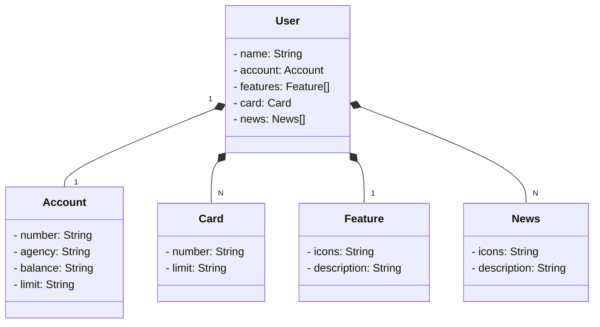

# Santader Dev Week 2023
Java RESTful API criada para o Santander Dev Week.

## Diagrama de Classes

## Publicando API REST na Nuvem Usando Spring Boot, Java 17 e Railway

* Criação e Versionamento da API com Spring Initializr e Github
* Abstração e Modelagem do Domínio Figma, GhatGPT (Mermaid) e JPA
* Implementação do Backend Spring Boot e Java 17
* Deploy e Monitoramento Railway (PostgreSQL e CI/CD da API
